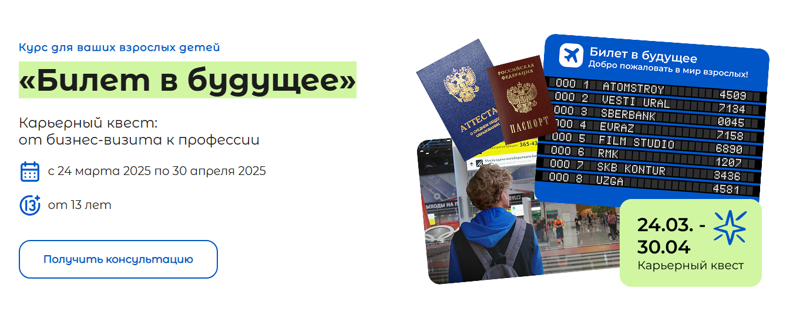

# Лендинг программы "Билет в будущее"

Верстка адаптивной и интерактивной страницы для карьерного квеста в рамках программы "Билет в будущее". 
Это реальный рабочий проект, интегрированный в основной сайт Центра бизнес-образования.

<a href="https://dron-olya7.github.io/ticket-to-the-future/" target="_blank">Ссылка на просмотр</a>

## Функциональность и особенности
**Адаптивный дизайн**: Отображение на всех устройствах (десктоп, планшет, мобильные).

**Семантическая верстка**: Грамотное использование HTML5 тегов для доступности и SEO.

**Плавные анимации**: Различные CSS-анимации для улучшения пользовательского опыта.

**Pixel Perfect**: Точное соответствие макету.

## Стек технологий
HTML5

CSS3 (Flexbox, Grid, анимации)

Ванильный JavaScript (ES6+)

Методология БЭМ 

## Ссылки
<a href="https://cbo.ru/program/bilet-v-budushee-kar-ernyj-kvest-ot-biznes-vizita-k-professii">Страница</a> — Посмотреть проект в работе.

<a href="https://cbo.ru/">Центр бизнес-образования</a> — Основной сайт.

